# Heap & Max-Heap


## How is a heap made?

A heap can be made when a **complete** binary tree is presented where

### #1   **all it's leaf nodes meet at the same level**

### #2   **fills from left to right.**

This is because a complete binary tree doesn't skip over any nodes which allows us to do something real interesting

---

## An Incomplete Tree

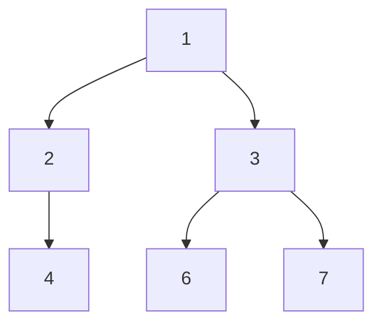

## A Complete Tree
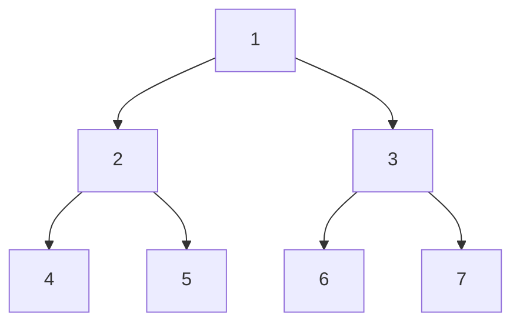


## Also a Complete Tree
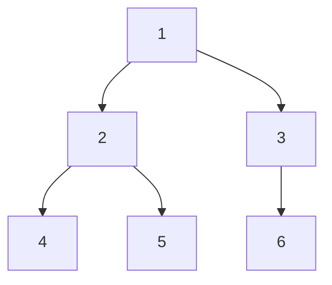

---

So what do we then do with a Complete tree?

We turn it into an Array!

If you look at the previous complete tree can you see a patern emerge from the nodes?

The pattern is that (if there are no skips) every child will be $2n$ or $2n+1$ of it's parent.

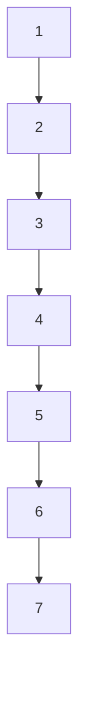
---
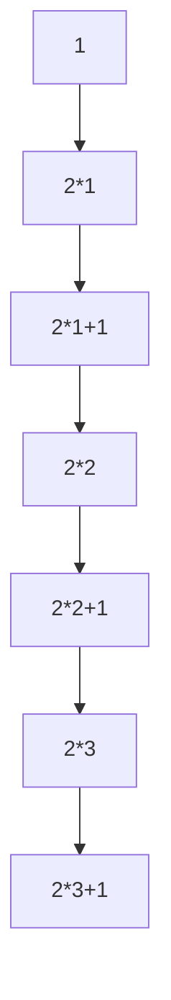
---
We treat the array as if it were a tree. this gives us the benefits of the simplicity of an array and the efficiency of a tree.

By doing this we abandon the need for pointers to children because we can just index though an array. This also allows us to freely move forwards and backwards though a tree. 

# Visualizing a Max-Heap

A Max-Heap is a complete binary tree with 2 more properties.

### #1   **The value of each parent node is greater than or equal to the values of its children**

### #2   **Both the left and right child of every node is itself a Max-Heap**

Rule #2 is very interesting as it demands a Max-Heap in the definition of a max-Heap

Example

```mermaid
graph TD
  A[8]
  B[7]
  C[6]
  D[5]
  E[4]
  F[3]
  G[2]
  A --> B
  A --> C
  B --> D
  B --> E
  C --> F
  C --> G

  ```

---
## Lets create a max-Heap

### Inserting this list [10, 20, 5, 6, 1, 8, 9]

It's gotta maintain it's max-Heap status thoughout the process though

[10, 20, 5, 6, 1, 8, 9]
Step 1: Insert 10

```mermaid
graph TD
  A[10]
```
[20, 5, 6, 1, 8, 9]
Step 2: Insert 20 → Swap with 10

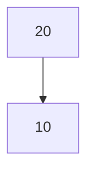
[5, 6, 1, 8, 9]
Step 3: Insert 5 → No swap needed

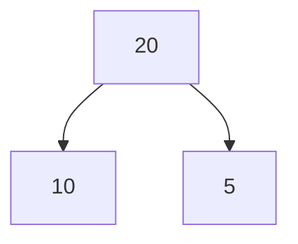
[6, 1, 8, 9]
Step 4: Insert 6 → No swap needed

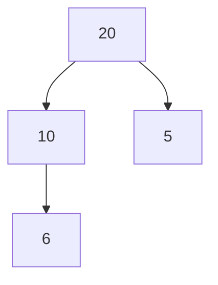
[1, 8, 9]
Step 5: Insert 1 → No swap needed

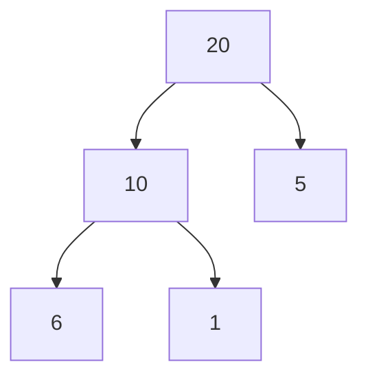
[8, 9]]
Step 6: Insert 8 → Swap with 5

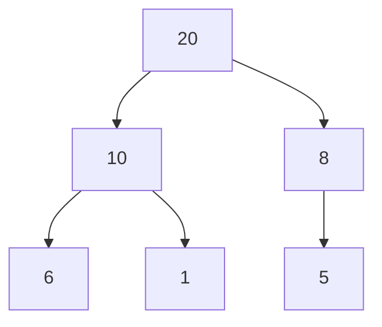
\[9]
Step 7: Insert 9 → Swap with 8

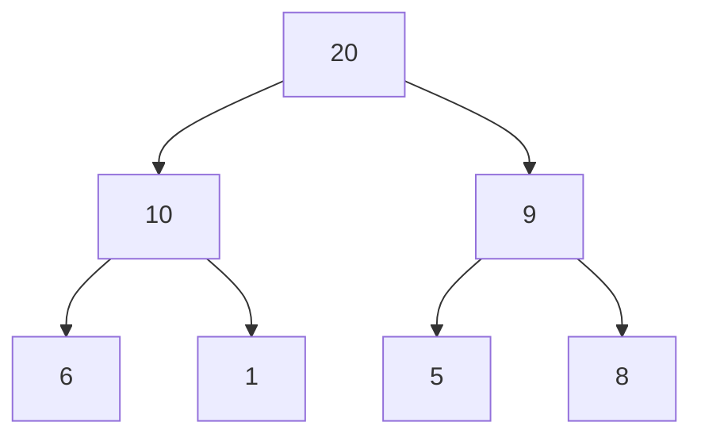